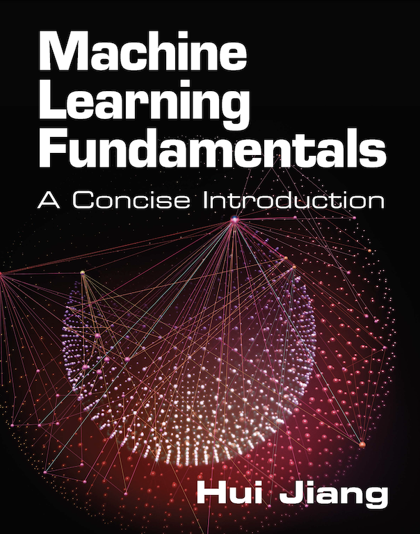

# "Machine Learning Fundamentals" Book
The companion repository for the book [**Machine Learning Fundamentals**](https://www.amazon.com/Machine-Learning-Fundamentals-Concise-Introduction/dp/1108940021) ©[*Hui Jiang*](https://wiki.eecs.yorku.ca/user/hj/) 2021, published by Cambridge University Press.
<div style="text-align: center">

</div>


## Slides per chapter (Detailed  contents is [here](materials/DetailedContents.pdf))

- **Ch 1: Introduction**    ([slides](materials/slides/ch1_Introduction.pdf))
- **Ch 2:  Mathematical Foundation**  ([slides](materials/slides/ch2_Mathematical_Foundation.pdf))
- **Ch 3: Supervised Machine Learning (in a nutshell)** ([slides](materials/slides/ch3_Supervised_Machine_Learning.pdf))
- **Ch 4: Feature Extraction** ([slides](materials/slides/ch4_Feature_Extraction.pdf))
- **Ch 5: Statistical Learning Theory** ([slides](materials/slides/ch5_Statistical_Learning_Theory.pdf))
- **Ch 6: Linear Models** ([slides](materials/slides/ch6_Linear_Models.pdf))
- **Ch 7: Learning Discriminative Models in General** ([slides](materials/slides/ch7_Learning_Discriminative_Models.pdf))
- **Ch 8: Neural Networks** ([slides](materials/slides/ch8_Neural_Networks.pdf))
- **Ch 9: Ensemble Learning** ([slides](materials/slides/ch9_Ensemble_Learning.pdf))
- **Ch 10: Overview of Generative Models** ([slides](materials/slides/ch10_Overview_Generative_Models.pdf))
- **Ch 11: Unimodal Models** ([slides](materials/slides/ch11_Unimodal_Models.pdf))
- **Ch 12: Mixture Models** ([slides](materials/slides/ch12_Mixture_Models.pdf))
- **Ch 13: Entangled Models** ([slides](materials/slides/ch13_Entangled_Models.pdf))
- **Ch 14: Bayesian Learning** ([slides](materials/slides/ch14_Bayesian_Learning.pdf))
- **Ch 15: Graphical Models** ([slides](materials/slides/ch15_Graphical_Models.pdf))

## Lab Projects (using Jupyter Notebooks and/or Matlab)

NOTE: we are still working on these labs and each lab will be made public as soon as it is finalized. 

- **Lab 0**: [Preparation](labs/pdf/Lab0_Preparation.pdf)  (available at [Colab](https://colab.research.google.com/drive/1nB-uULhbpFTqlUOekEW3272eqKJg6qok?usp=sharing), [ipynb](labs/ipynb/Lab0_Preparation.ipynb), matlab)
- **Lab 1**: [Data Visualization](labs/pdf/Lab1_Data_Visualization.pdf) (available at [Colab](https://colab.research.google.com/drive/1zE2OrdJNkmzzn30CdDsj1y9qz585-afF?usp=sharing), [ipynb](labs/ipynb/Lab1_Data_Visualization.ipynb), matlab)
- **Lab 2**: [Linear Regression](labs/pdf/Lab2_Linear_Regression.pdf)  (available at [Colab](https://colab.research.google.com/drive/1Ix04T8y0evnFnXWvHHWu0KfqsOA48hUg?usp=sharing), [ipynb](labs/ipynb/Lab2_Linear_Regression.ipynb), matlab)
- **Lab 3**: [Logistic Regression](labs/pdf/Lab3_Logistic_Regression.pdf)  (available at [Colab](https://colab.research.google.com/drive/1qUi2qgwBMmHJb7Bx7ca_braGtptmzFOQ?usp=sharing), [ipynb](labs/ipynb/Lab3_Logistic_Regression.ipynb), matlab)
- **Lab 4**: [Support Vector Machines](labs/pdf/Lab4_Support_Vector_Machine.pdf) (available at [Colab](https://colab.research.google.com/drive/1vlN46Xhfv4ES8jFWWI0iTj3WHKjb0KMg?usp=sharing), [ipynb](labs/ipynb/Lab4_Support_Vector_Machine.ipynb), matlab)
- **Lab 5**: [Fully-Connected Neural Networks](labs/pdf/Lab5_Fully_Connected_Neural_Networks.pdf) (available at [Colab](https://colab.research.google.com/drive/1TY3fAAS18lyGrlEsvLhaYm6fIBP7CDgD?usp=sharing), [ipynb](labs/ipynb/Lab5_Fully_Connected_Neural_Networks.ipynb), matlab)
- **Lab 6**: [Convolutional Neural Networks](labs/pdf/Lab6_Convolutional_Neural_Networks.pdf)  (available at [Colab](https://colab.research.google.com/drive/1Zkeujeoh4jNR9bQ67kfuIE7cV6KifZS2?usp=sharing), [ipynb](labs/ipynb/Lab6_Convolutional_Neural_Networks.ipynb), matlab)
- **Lab 7**: Recurrent Neural Networks and Transformers 
- **Lab 8**: Matrix Factorization 
- **Lab 9**: Decision Trees, Random Forests and Boosted Trees 
- **Lab 10**: Gaussian Classifiers and Gaussian Mixture Models 

## Citation (bibtex):
```
@book{Jiang-MLF-2021, 
  author = {Hui Jiang},
  title = {Machine Learning Fundamentals}, 
  publisher = {Cambridge University Press},
  year = {2021} 
}
```
